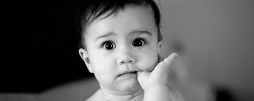

#{{ page.title }}

##É o resultado de um parto laborioso onde houve lesão neuronal por tração ou avulsão das fibras do plexo braquial durante as manobras obstétricas quando do desprendimento do ombro do recém nascido.

Em geral, as fibras superiores do plexo são as mais acometidas , porém sofrem avulsão mais raramente que as fibras inferiores, ou seja, as fibras mais caudais tendem a ter mais lesões por neurotmesis enquanto as mais craniais tendem à lesão por neuropraxia.

É o mecanismo do parto de extrema importância na gênese desse tocotraumatismo, sobretudo no parto pélvico com cabeça derradeira levando o obstetra menos experiente a realizar manobras mais vigorosas na tentativa de desprender a criança tracionando a coluna cervical ou deixando que a gravidade o faça.

Esse tipo de trauma fechado também pode ser observado no parto em apresentação cefálica após o desprendimento da cabeça quando o obstetra a traciona junto com o pescoço da criança para desprender o ombro, principalmente o direito que cavalga na púbis materna explicando-se essa maior incidência visto a maior frequência de apresentações cefálicas em oblíquo anterior esquerdo, nesse caso o ombro direito preso no estreito inferior é que sofre tração levando à lesão neuronal.

Outros fatores também pertinentes são: macrossomia fetal ( principalmente se acima de 4 kg ) , diabete materno , distocia de ombro e mãe de idade avançada.

##Diagnóstico

A identificação da PO é em sua essência clínica possível já no berçário com uma avaliação neurológica sumária do RN somada à história obstétrica e do parto. Com frequência, é a mãe que indaga ao médico a fraqueza ou hipotonia em um braço da criança que não está sendo usado espontaneamente e que , as vezes, leva ao choro quando manipulado. Entretanto alguns estudiosos sugerem uma avaliação clínica mais precisa após 3 semanas do nascimento quando o quadro se torna melhor definido.

Na verdade ocorre uma paralisia flácida total ou parcial do membro acometido onde o primeiro passo é definir a anatomia da lesão. Esta, quando supraclavicular , acomete músculos mais proximais como os abdutores do braço e flexores do cotovelo podendo também comprometer a supinação do antebraço e extensão da mão. Quando a lesão é mais baixa ou infraclavicular a principal característica é o comprometimento dos flexores do punho e dedos lembrando que esses padrões podem vir associados.

Ainda na localização da lesão, é importante definir se é distal ou proximal ao gânglio da raiz dorsal pois quando pré-ganglionar jamais se recupera e quando pós-ganglionar o faz algumas vezes. Nessa avaliação, se a criança não consegue elevar a escápula espontaneamente e/ou apresenta síndrome de Horner ( miose, ptose palpebral e enoftalmia ) poderemos pensar que a lesão está mais próxima da medula ( pré-ganglionar ) sendo o prognóstico mais reservado.

A paralisia obstétrica se manifesta através de três formas clínicas distintas baseado na localização e gravidade da lesão neuronal.

A paralisia braquial alta ( C5 / C6 ), superior ou de Erb-Duchenne corresponde a 75% dos casos. Aqui, o membro superior está flácido e rodado internamente , o antebraço pronado e o ombro não abduz ativamente , o cotovelo em extensão completa ou levemente fletido ( C7 ), o punho pode estar fletido assumindo a clássica postura de garçom pedindo gorgeta. O membro toma atitude de imobilidade junto ao tronco e quando solto cai ao longo do corpo. O reflexo de Moro está assimétrico, o bicipital ausente e o de preensão palmar preservado. A sensibilidade tátil e dolorosa é normal no antebraço e mão e não há fenômenos vasomotores na extremidade. Vale lembrar que o nervo frênico não faz parte do plexo braquial, logo, não há manifestações respiratórias ou a ele relacionadas.

Com a evolução, a criança pode sair dessa fase aguda ou inicial e se recuperar espontaneamente em até 40% dos casos em até 18 meses de idade, mas se o desequilíbrio muscular persistir surgem deformidades fixas como contraturas e alterações osteoarticulares. Ocorre limitação na abdução, rotação externa do membro e flexão do cotovelo sendo que quando solicitada a levar a mão à boca manifesta o sinal do corneteiro, ainda há deformidade do processo coracóide e acrômio que ficam alongados, afilados e voltados para baixo como resultado do distúrbio muscular prolongado, a cavidade glenóide se torna mais rasa predispondo a luxação posterior do ombro.

O segundo tipo mais frequente é a paralisia braquial total ( C5 / C6 / C8 / T1) que corresponde a 24% dos casos. Aqui, todo o membro é flácido e não há resposta a estímulos sensitivos. Acrecenta-se a ausência do reflexo de preensão palmar e presença de fenômenos vasomotores como palidez ou vermelhidão da pele. Pode ocorrer lesão do gânglio cervicotorácico ou estrelado manifestando a síndrome de Claude-Bernard-Horner ipsilateral.Os demais reflexos também estão ausentes e algumas vezes com a evolução do processo a paralisia total regride para uma paralisia superior.

A terceira forma , mais rara , é a paralisia braquial baixa, inferior ( C8 / T1 ) conhecida como paralisia de Klumpke. Aqui, existe déficit motor e sensitivo da mão, estando o ombro e o cotovelo com mobilidade ativa preservada. O reflexo de Moro e bicipital estão presentes , mas o de preensão palmar está ausente devido a paralisia da musculatura flexora do punho e dedos. Ocorre déficit sensorial da borda ulnar do antebraço e mão sendo comum a associação com síndrome de Horner. Como em geral há neurotmesis ou avulsão das raízes inferiores o prognóstico é pior, não há recuperação espontânea e criança evolui com atrofia muscular e diminuição do crescimento do membro.

Todas essas formas evoluem de acordo com o grau de lesão neuronal e se não houver recuperação na contração do bíceps braquial e do deltóide até o terceiro mês de idade provavelmente há neurotmesis e necessidade de exploração cirúrgica. Caso haja alguma contração em um desses músculos até o segundo mês de vida o prognóstico é melhor e a recuperação completa mais provável.

Ainda como abordagem diagnóstica podemos solicitar alguns exames como a radiografia simples à procura de fraturas associadas e das deformidades osteoarticulares possíveis numa fase mais tardia. A ultrasonografia do ombro pode mostrar deslocamentos epifisário proximal do úmero que inicia sua ossificação a partir do terceiro mês de idade. A mielografia cervical ou radiculografia que pode ser feita a partir da terceira semana de vida e permite identificar avulsões, lacerações e meningoceles traumáticas ao longo das raízes. A tomografia computadorizada e , melhor ainda, a ressonância nuclear magnética podem mostrar claramente a lesão e , por fim, o estudo eletroneuromiográfico de grande valor na identificação do nervo lesado ,mas principalmente no acompanhamento desses pacientes sobretudo na recuperação pós-operatória.

A exploração clínica e complementar minunciosa deve ser rotina para todos os casos no sentido de excluir diagnósticos diferenciais como a paralisia cerebral , lesões da cintura escapular como fraturas da clavícula, úmero e deslocamentos epifisários proximal do úmero, osteomielite neonatal, artrite piogênica do ombro e sífilis congênita.

Qualquer dúvida que tenha, deixe um comentário.
