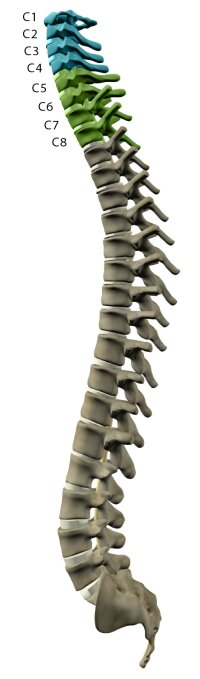
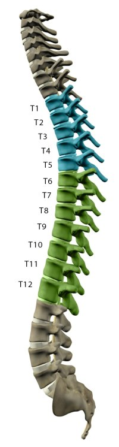
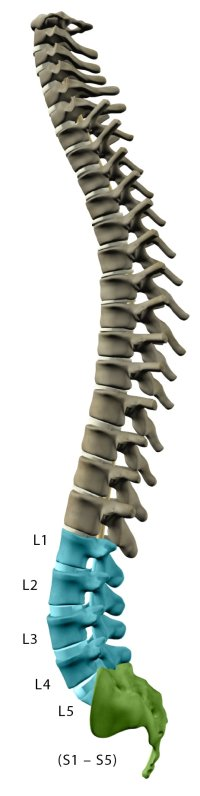

# {{ page.title }}

As vértebras estão agrupadas em secções. No que diz respeito à zona da medula espinal, quanto mais subida for a lesão, mais severas são as possíveis disfunções dela resultantes.

## Nervos Cervicais Superiores (C1 – C4)

* Os níveis de lesão da medula espinal mais severos
* Paralisia nos braços, mãos, tronco e pernas
* O paciente não será capaz de respirar sozinho, tossir ou controlar os movimentos intestinais ou a bexiga.
* A capacidade de falar é, por vezes, afetada ou reduzida.
* Quando os quatro membros ficam afetados, denomina-se tetraplegia ou quadiplegia.
* Exige total assistência nas atividades da via diária, como comer, vestir, tomar banho, e entrar e sair da cama.
* Pode ser capaz de usar cadeiras de rodas elétricas com controlos especiais para poder deslocar-se por sua conta
* Não será capaz de conduzir automóveis por sua conta
* Exige cuidados pessoais 24 horas por dia

## Nervos Cervicais Inferiores (C5 – C8)

* Estes nervos controlam os braços e as mãos.
* Uma pessoa com este nível de lesão pode ser capaz de respirar sozinho e falar normalmente.

## Lesão na C5

* A pessoa é capaz de levantar os braços e dobrar os cotovelos.
* Possivelmente terá paralisia total ou parcial nos pulsos, mãos, tronco e pernas
* Pode falar e usar o diafragma, mas terá problemas para respirar
* Irá necessitar de assistência na maioria das atividades diárias, mas poderá mover-se de forma independente numa cadeira de rodas elétrica.

## Lesão na C6

* Os nervos afetam a extensão dos pulsos
* Tipicamente, paralisia nas mãos, tronco e pernas
* Deve ser capaz de dobrar os pulsos para trás
* Pode falar e usar o diafragma, mas terá problemas para respirar
* Consegue sentar-se na cadeira de rodas e sair dela e consegue entrar e sair da capa com a ajuda de equipamentos de apoio.
* Também poderá conduzir um veículo adaptado
* Pouco ou nenhum controlo voluntário da bexiga e intestinos, mas pode ser capaz de controlar com a ajuda de equipamento especial

## Lesão na C7

* Os nervos controlam a extensão dos cotovelos e alguma extensão dos dedos.
* A maior parte das pessoas conseguem esticar o braço e mover normalmente os ombros.
* É capaz de realizar por sua conta a maioria das atividades diárias, mas poderá precisas de assistência nas tarefas mais difíceis 
* Também poderá conduzir um veículo adaptado
* Pouco ou nenhum controlo voluntário da bexiga e intestinos, mas pode ser capaz de controlar com a ajuda de equipamento especializado

## Lesão na C8

* Os nervos controlam alguns movimentos das mãos.
* Deve ser capaz de agarrar e largar objetos
* É capaz de realizar por sua conta a maioria das atividades diárias, mas poderá precisas de assistência nas tarefas mais difíceis
* Também poderá conduzir um veículo adaptado
* Pouco ou nenhum controlo voluntário da bexiga e intestinos, mas pode ser capaz de controlar com a ajuda de equipamento especializado

# As vértebras torácicas situam-se a meio da coluna.

## Nervos Torácicos (T1 – T5)

* Estes nervos afetam os músculos, o tórax superior e os músculos abdominais.
* A função dos braços e mãos é tipicamente normal.
* As lesões afetam normalmente o tronco e as pernas (também conhecida como paraplegia).
* Provavelmente é capaz de usar cadeiras de rodas manuais
* Pode aprender a conduzir um carro modificado
* É capaz de ficar em pé, enquanto outros podem andar com órteses

## Nervos Torácicos (T6 – T12)

* Os nervos afetam os músculos do tronco (músculos abdominais e dorsais), dependendo da gravidade da lesão.
* Normalmente resulta em paraplegia
* Movimento normal da parte superior do corpo
* Capacidade satisfatória a boa de controlar e equilibrar o tronco enquanto está sentado
* Deve ser capaz de tossir produtivamente (se os músculos abdominais estiverem intactos)
* Pouco ou nenhum controlo voluntário da bexiga ou do intestino, mas pode ser capaz de controlar com a ajuda de equipamento especial
* Provavelmente é capaz de usar cadeiras de rodas manuais
* Pode aprender a conduzir um carro modificado
* Algumas pessoas podem ficar em pé, enquanto outras são capazes de andar com órteses

## Nervos Lombares (L1 – L5)

* As lesões resultam geralmente numa perda parcial da função das ancas e pernas.
* Pouco ou nenhum controlo da bexiga ou intestinos, mas consegue controlar com a ajuda de um equipamento especial
* Poderá necessitar de uma cadeira de rodas ou poderá andar com órteses, dependendo da força nas pernas

## Nervos Sacrais (S1 – S5)

* As lesões resultam geralmente na perda parcial do funcionamento das ancas e pernas
* Pouco ou nenhum controlo da bexiga ou intestinos, mas consegue controlar com a ajuda de um equipamento especial
* A maior parte das pessoas conseguem andar

Qualquer dúvida que tenha, deixe um comentário.
